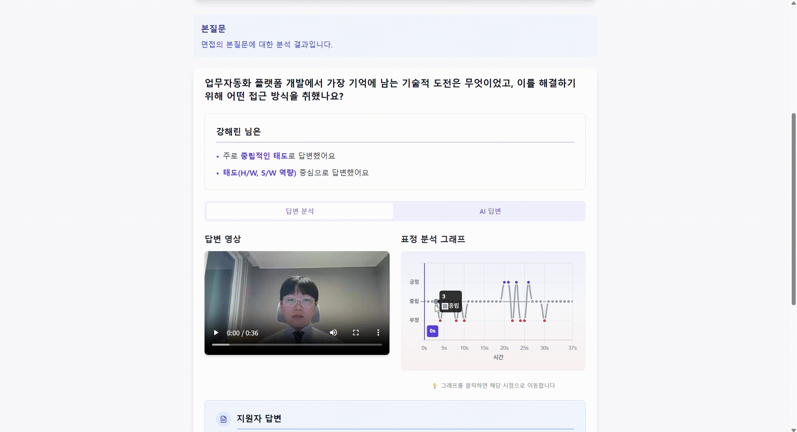

<div align="center">
  
  <h2> Re:View : AI 기반 온라인 화상 면접 코칭 플랫폼</h2>
  <p> 당신의 취업 성공을 위하여, AI 기반 질문 생성부터 피드백까지 </p>
  <p> 공통 프로젝트 부울경 2반 TEAM 06 - 개린이집 </p>
</div>

---

## 📑 목차
1. [🚀 프로젝트 소개](#intro)
2. [🛠️ 기술 스택](#tech)
3. [💡 주요 기능](#func)
4. [📂 시스템 아키텍처](#arch)
5. [⚙️ 실행 방법](#meth)
6. [🖥️ 서비스 화면](#view)
7. [👨‍👩‍👧‍👦 개발 팀 소개](#team)
8. [🗓️ 개발 일정](#date)
9. [📝 산출물](#output)


## 🚀 프로젝트 소개 <a id="intro"></a>
**"AI 기반 온라인 화상 면접 코칭 서비스"**

> **Re:View**는 **실제 면접 환경과 유사한 모의 면접 환경**을 제공하고, **AI 기반 피드백 및 반복 학습 기능**을 통해 면접 준비에 최적화된 경험을 제공합니다.  

- **개발 기간** : 2025.07.14 ~ 2025.08.18
- **플랫폼** : Web (PC/모바일 웹)
- **개발 인원** : 6명

### 🔗 [서비스 바로가기](https://i13e206.p.ssafy.io/)

## 🛠️ 기술 스택 <a id="tech"></a>

### Frontend


### Backend


### AI


### Infra & DevOps


### Database


### Tools


## 💡 주요 기능 <a id="func"></a>

| 기능 | 설명 |
|------|------|
| **WebRTC 기반 화상 면접** | OpenVidu 3 (v2.30.0) 활용하여 실제 면접과 유사한 환경 제공 |
| **맞춤형 질문 생성** | 지원서, 포트폴리오, 답변 스크립트, 음성 데이터를 OCR/Whisper로 텍스트화 후 질문 생성 |
| **표정 감정 분석** | DeepFace 기반 긍/부정/중립 감정 분석 |
| **음성 답변 분석** | Whisper + KoBERT 기반 답변 의도 분석 |
| **AI 분석 리포트** | 답변 전사, 모범 답안 생성, 감정 분석, 답변 피드백 제공 |
| **Retry 기능** | 부족했던 질문을 반복 연습 가능 |
| **PT 면접 화이트보드** | 화이트보드를 통한 발표형 면접 연습 지원 |

---

## 📂 시스템 아키텍처 <a id="arch"></a>

아래 다이어그램은 서비스의 인프라 및 통신 구조를 보여줍니다.  


- **사용자** → Nginx(443) → Backend(Spring Boot)  
- **Frontend** → Vite 기반 SPA로 사용자 인터페이스 제공, API/WS 연동  
- **Backend** → DB(RDS), Cache(Redis), Messaging(Kafka)  
- **AI 서버** → 면접 영상/음성 분석 → Backend 전달  
- **OpenVidu** → 실시간 화상 면접 지원  
- **Prometheus + Grafana** → 모니터링 및 알람

---

## ⚙️ 실행 방법 <a id="meth"></a>

### 1. 환경 변수 설정
```bash
# .env 예시
DB_HOST=your-rds-url
DB_USER=admin
DB_PASSWORD=secret
REDIS_HOST=localhost
KAFKA_BROKER=localhost:9092
```

### 2. Docker 실행
```
# 백엔드 빌드 & 실행
cd backend
./gradlew build
docker build -t backend-app .

# 프론트엔드 로컬 실행
cd frontend
npm install -g pnpm
pnpm install
pnpm dev

# 프론트엔드 실행
cd frontend
npm install -g pnpm
pnpm install
pnpm run build
docker build -t frontend-app .

# 도커 컴포즈 실행
docker-compose up -d
```

---

## 🖥️ 서비스 화면 <a id="view"></a>
### 랜딩 페이지


- 서비스 소개, 면접 기능 설명, 사용자 리뷰

### 면접 준비


- 기업 및 직무 선택, 파일 업로드, 면접 준비 테스트

### 면접 진행


- 인성/직무 : 본 질문 1개, 꼬리 질문 2개 1세트 면접 진행
- PT : 주제와 내용에 대한 답변 준비 및 발표 진행

### 결과 페이지


- 표정 분석, 답변 분류, 모범 답안, 

---

## 👨‍👩‍👧‍👦 개발 팀 소개 <a id="team"></a>
| 사진                                                       | 이름  | 역할           | GitHub                                   |
| -------------------------------------------------------- | --- | ------------ | ---------------------------------------- |
|   | 김민석 | `FE` `Leader`         | [@silence102](https://github.com/silence102)   |
|        | 권인  | `FE`         | [@iiiiin](https://github.com/iiiiin)             |
|    | 박희재 | `FE`         | [@heejae](https://github.com/heejae)     |
|     | 이아현 | `BE`         | [@yuju9](https://github.com/yuju9)       |
|    | 이희산 | `BE`         | [@Lee-heesan](https://github.com/Lee-heesan)     |
|  | 최민석 | `BE` `Infra` | [@m0304s](https://github.com/m0304s) |


---

## 🗓️ 개발 일정 <a id="date"></a>

- **1주차 (7/14 ~ 7/20)**: 프로젝트 기획
- **2주차 (7/21 ~ 7/27)**: 설계 및 구체화
- **3주차 (7/28 ~ 8/3)**: 인프라 및 구현
- **4주차 (8/4 ~ 8/10)**: 구현 및 연동
- **5주차 (8/11 ~ 8/17)**: 마무리
- **8/18**: 최종 프로젝트 평가


---

## 📝 산출물 <a id="output"></a>

### 1. 🔗 [요구사항 명세서](https://www.notion.so/232ab603db8b81f3b381fe4a22510014)
### 2. 🔗 [와이어프레임](https://readdy.link/preview/471eb4e1-f504-4698-86ad-bea71a42e256/1294241)
### 3. 🔗 [ERD](https://www.erdcloud.com/d/GfH9cXzfcnLRSJvqN)
### 4. 🔗 [API 문서](https://phase-football-921.notion.site/API-232ab603db8b810e87a7d592a6b0ae28?source=copy_link)
