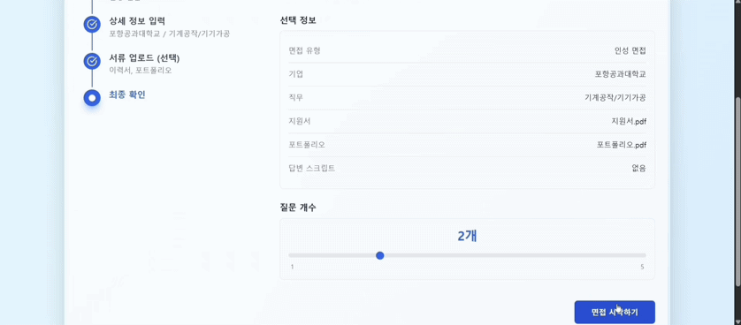
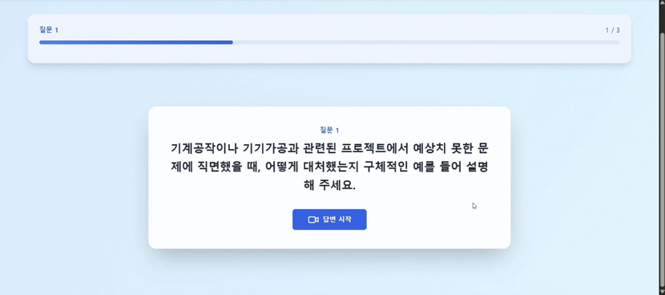
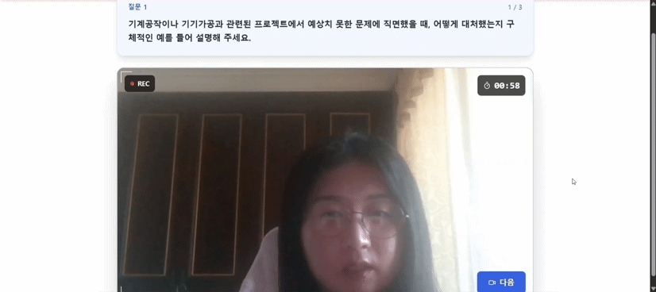
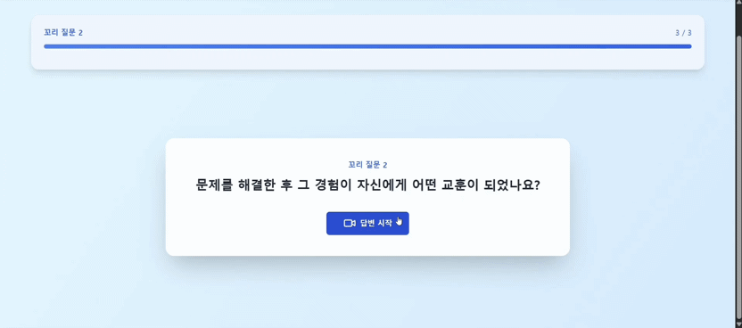
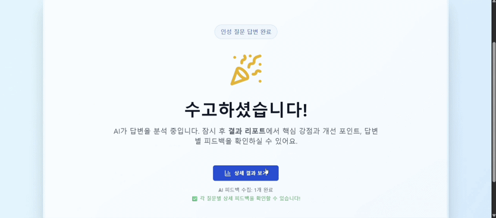
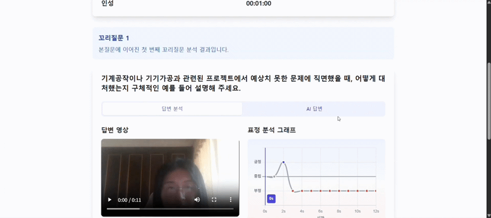
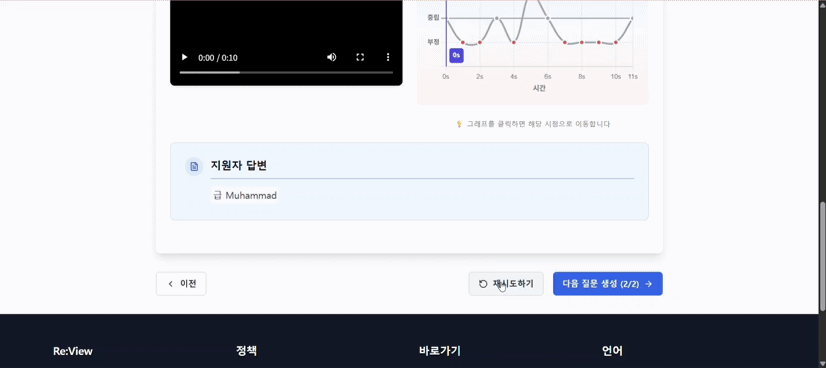

# 시연 시나리오

## 시나리오 1 : 랜딩 페이지 간단 서비스 이해

| 구분 | 시연 화면 (GIF) |
| --- | --- |
| 메인 페이지 진입 |  |
| 로그인을 통해 AI 면접 서비스 이용 가능 |  |

 

## 시나리오 2 : 질문 생성 및 준비 과정

| 구분 | 시연 화면 (GIF) |
| --- | --- |
| 면접 유형 및 기업, 직무 선택 |   |
| 이력서, 포트폴리오, 답변 스크립트 업로드 |  |
| 면접 준비 |  |

 

## 시나리오 3 : 모의 면접 진행

| 구분 | 시연 화면 (GIF) |
| --- | --- |
| 질문 자동 생성 | |
| 화면을 보며 답변하기 | |
| 꼬리질문 생성 | |

 

## 시나리오 4 : 즉시 피드백 확인, 피드백 핵심 강조

| 구분 | 시연 화면 (GIF) |
| --- | --- |
| 면접이 끝난 즉시 피드백 확인 | |
| 표정 분석 및 AI 예시 답변 확인 |  |

 

## 시나리오 5 :  Retry로 스크립트 재연습

| 구분 | 시연 화면 (GIF) |
| --- | --- |
| 리트라이 버튼 누르면 질문이 다시 생성 | |